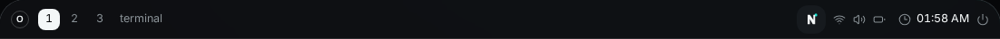
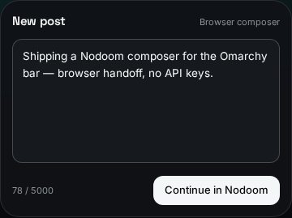

# nodoom.composer

Compose Nodoom posts from the Omarchy bar.

Adapted from [bitr0t.omarchytweet](https://github.com/rmacy/omarchytweet) — same job queue, same private redirect handoff, same draft persistence. Nodoom has no public write API, so this plugin is **browser handoff only**.

## Screenshots

### Bar widget



### Composer popover



## Posting mode

**Browser composer (the only mode, free)** — opens [nodoom.app/composer](https://nodoom.app/composer) via `xdg-open`, copies the draft to the clipboard, then pastes it into the composer textarea (Ctrl+V via hyprctl / wtype / ydotool). You press the final **Post** button in your browser. No API keys needed.

Stay logged in; if the box is empty, press Ctrl+V.

24-hour vs permanent expiry is chosen in Nodoom's own composer after the handoff.

## Install

```sh
omarchy plugin add https://github.com/maiosx/omarchynodoom.git --enable
```

Then restart the shell if the bar icon does not appear: `omarchy restart shell`.

From a local checkout:

```sh
omarchy plugin add ./omarchynodoom --enable
```

## Configure

```sh
mkdir -m 700 -p ~/.config/npost
cp ~/.config/omarchy/plugins/nodoom.composer/config.example.toml ~/.config/npost/config.toml
chmod 600 ~/.config/npost/config.toml
```

Edit `~/.config/npost/config.toml` to set `copy_draft`, `auto_paste`, and `paste_delay`. The backend also generates this template with correct permissions on first run.

## Controls

- Click the **N** icon in the bar to open the composer panel.
- **Enter** submits; **Shift+Enter** inserts a newline; **Escape** dismisses.
- The action button is always *Continue in Nodoom*.
- Drafts persist across panel open/close cycles and are shared across monitors.
- Posts are capped at 5,000 characters (Nodoom's composer limit).

## Optional CLI

The `bin/npost` wrapper resolves the backend relative to itself. Symlink it into your PATH:

```sh
ln -sf ~/.config/omarchy/plugins/nodoom.composer/bin/npost ~/.local/bin/npost
```

Post text is always passed on **stdin**, never as a command-line argument:

```sh
printf '%s' 'Your post text here' | npost post
```

Other commands (`mode`, `enqueue`, `status`, `active`, `ack`, `draft`) pass through directly to the backend.

Exit codes: **0** composer opened; **1** failed / busy / unknown; **2** usage error.

## File architecture

```
backend.py              Posting backend (Python 3.11+ stdlib only)
Service.qml             Singleton service: backend IPC, draft state, job queue
Panel.qml               Per-monitor composer UI
manifest.json           Omarchy plugin metadata
config.example.toml     Configuration template
nodoom.png              Bar icon (symbolic, tinted to the bar foreground)
preview.png             Marketplace preview (bar + composer)
screenshots/            Browser-free detailed UI captures
bin/npost               Optional CLI wrapper (resolves backend relative to itself)
tests/test_backend.py   Isolated stdlib backend regression suite
pyproject.toml          Poetry development metadata (runtime has no dependencies)
LICENSE                 MIT license
```

Runtime state (job files, locks) lives under `$XDG_RUNTIME_DIR/nodoom.composer`. Drafts live in `~/.config/npost` (0700 dir, 0600 files).

## How the handoff stays off `/proc`

`xdg-open` exposes its argument through process metadata. The worker writes an owner-only local HTML redirect (`intent.html` inside the job directory) and passes **only that file URI** to `xdg-open`. The Nodoom composer URL — which may embed draft text as `?text=` if clipboard copy failed — never appears in argv.

Clipboard copy itself is stdin to `wl-copy` / `xclip` / `xsel`, never argv. Auto-paste sends Ctrl+V (clipboard), never types the draft as keystrokes.

## Development

```sh
omarchy plugin validate .
python3 tests/test_backend.py
```

Runtime never depends on Poetry.

## Security

- `~/.config/npost` is created with mode 0700; `config.toml` with 0600. Symlinks, foreign owners, and group/other permission bits are refused.
- Secrets are never logged, echoed, or included in JSON output (this plugin has none).
- The handoff URL embeds draft text only as a fallback and is never returned in JSON or logs.
- Post text arrives via stdin or job files — never via shell interpolation or command-line arguments.

## Uninstall

```
omarchy plugin remove nodoom.composer
```

Remove the optional CLI symlink and configuration if desired:

```sh
rm -f ~/.local/bin/npost
rm -rf ~/.config/npost
```

## License

MIT — see [LICENSE](LICENSE). Adapted from bitr0t.omarchytweet by Ryan Macy.
